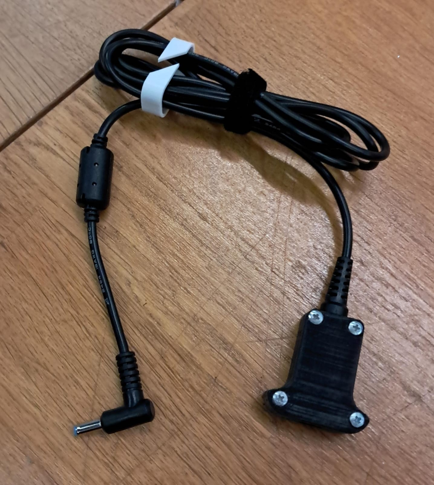
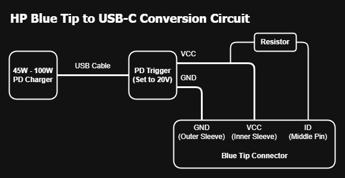
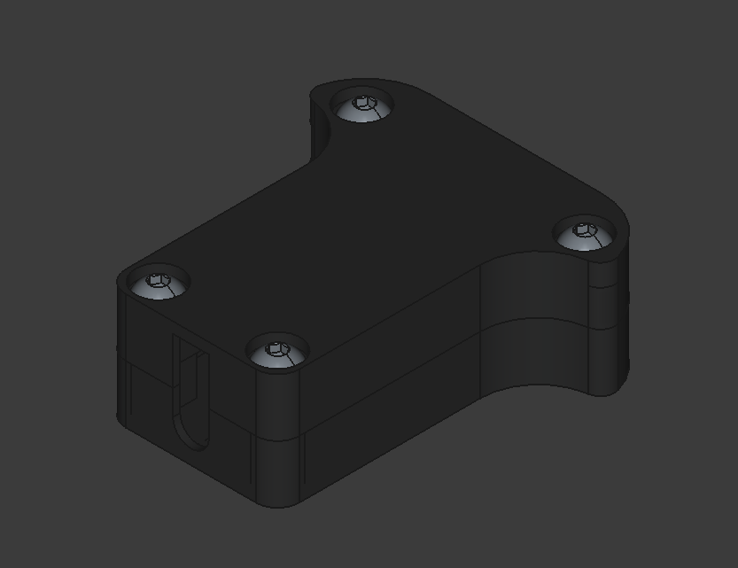

# HP Laptop USB-C PD Charging Adapter (Blue Tip Mod)

This repository documents the design and assembly of a custom adapter allowing HP laptops with proprietary "Blue Tip" (4.5mm x 3.0mm) connectors to utilize USB-C Power Delivery (PD) charging sources.

_Figure 1: Assembled adapter._

## Project Objective

While native USB-C charging is standard on most modern devices, many HP laptops still rely on the proprietary "Blue Tip" barrel connector and lack USB-C power input. This forces users to carry a bulky, dedicated AC adapter in addition to their phone chargers.

This project solves this inconvenience by enabling the use of compact, universal USB-C PD chargers (the same ones used for smartphones) to power these HP laptops. It eliminates the need for the original heavy power brick by:

1.  Negotiating a 20V output from a standard USB-C PD source.
2.  Spoofing the proprietary "Smart Pin" signal to simulate a genuine HP power supply.
3.  Housing the circuitry in a custom, durable 3D-printed enclosure.

## Technical Implementation

### Power Delivery Triggering

The circuit utilizes a PD trigger module to request a fixed **20V** profile from the USB-C charger. While HP laptops nominally operate at 19.5V, the 20V standard falls within the safe input voltage tolerance of the device's power regulation circuitry.

_Figure 2: PD trigger module that I used._

### Smart Pin Spoofing

HP power supplies identify their wattage capacity via an analog signal on the central ID pin. This project replicates that signal using a pull-up resistor connected between the **V+ (20V)** line and the **ID Pin**.

_Figure 3: Circuit wiring diagram._

### Connector Pinout & Safety Warning

The HP "Blue Tip" (4.5mm) connector consists of three connection points.

- **Outer Sleeve:** Ground (GND)
- **Inner Ring:** V+ (19.5V / 20V)
- **Center Pin:** ID (Smart Pin Signal)

> **⚠️ CRITICAL WARNING:** Replacement cable wire colors are **NOT standard** and vary significantly between manufacturers.
>
> **Do not rely on color codes.** You **MUST** use a multimeter in continuity mode to identify which wire corresponds to the Inner Ring, Outer Sleeve, and Center Pin before soldering. Failing to do so may reverse polarity and damage your laptop.

### Resistor Values

To emulate specific wattage ratings, the corresponding resistor must be soldered between the V+ line and the ID Pin.

| Target Power Rating | Required Resistor  |
| :------------------ | :----------------- |
| **45W**             | **~470kΩ - 510kΩ** |
| 65W                 | ~383kΩ             |
| 90W                 | ~294kΩ             |

_Technical reference and signal logic derived from [Parkytowers](https://www.parkytowers.me.uk/thin/hp/hp_psu.shtml)._

## Bill of Materials

- **1x** USB-C PD Trigger Module (20V configuration)
- **1x** Resistor (See table above for values)
- **1x** HP Blue Tip Replacement Cable (4.5mm x 3.0mm)
- **1x** 3D Printed Enclosure
- **4x** M3x10 ISO7380-1 Screws

## Charger & Cable Requirements

Not all USB-C chargers will work. The PD Trigger module requires a specific handshake to output 20V.

1.  **Charger:** Must support **Power Delivery (PD) protocol** and strictly support **20V output**.
    - _Compatible:_ 45W, 65W, 100W GaN Chargers.
    - _Incompatible:_ Standard 5V phone chargers, QC3.0 chargers without PD.
2.  **USB-C Cable:** Must be rated for at least **3A (60W)**. For higher power setups (65W+), a 5A E-Marked cable is recommended.

## 3D Enclosure

A custom enclosure designed in FreeCAD is provided to secure the components. The design consists of two parts.

_Figure 4: 3D model render._

- **Source Files:** `stl/HP-PDM-Bottom.stl` `stl/HP-PDM-Top.stl`
- **Recommended Material:** PLA or PETG
- **Infill:** 100%
- **Layer Height:** 0.20mm or finer
- **Supports:** Required (design is optimized for FDM printing).
- **Orientation:** Print both parts vertical and print them on their widest part on ground.

## Assembly Instructions

1.  **Placement:** Insert the PD trigger board into its designated slot within the enclosure. Secure it in place using a small amount of hot glue.
2.  **Cable Strain Relief:** Insert the replacement cable's strain relief section into the enclosure, aligning it with the PD board's output pads accordingly.
3.  **Verification (Crucial Step):** Use a multimeter to confirm which wire is V+, GND, and ID. Label them if necessary.
4.  **Wire Prep:** Carefully trim the wires to the appropriate length and strip the insulation.
5.  **Soldering (Main Power):**
    - Solder the **V+ (Inner Ring)** wire to the **VCC/V+** pad on the PD board.
    - Solder the **GND (Outer Sleeve)** wire to the **GND** pad on the board.
6.  **Soldering (ID Resistor):**
    - Insulate the resistor legs using heat shrink tubing.
    - Solder one leg of the resistor to the **VCC/V+** pad.
    - Solder the other leg to the **ID (Center Pin)** wire.
7.  **Insulation & Securing:** Ensure all exposed connections are insulated. Use hot glue to cover the pads and secure wires against vibration.
8.  **Final Assembly:** Close the enclosure lid and fasten it using the four M3x10mm screws.

> **Final Voltage Check:** Before plugging the adapter into your laptop for the first time:
>
> 1. Connect the adapter to your USB-C charger.
> 2. Use a multimeter to measure the voltage at the HP tip.
> 3. Verify you have **+20V** on the Inner Ring and **0V (GND)** on the Outer Sleeve.
> 4. Only proceed if the polarity and voltage are correct.

## Troubleshooting

| Symptom                        | Possible Cause          | Solution                                                                                                             |
| :----------------------------- | :---------------------- | :------------------------------------------------------------------------------------------------------------------- |
| **No Voltage Output**          | Charger incompatibility | Ensure your USB-C charger supports **20V output** (check label).                                                     |
| **"Plugged in, not charging"** | Resistor issue          | Check if the resistor value matches your target wattage. Ensure solder joints on the ID pin are solid.               |
| **"Smart Pin Error" on Boot**  | ID Pin connection       | The center pin connection is likely broken or the resistor value is incorrect. Check continuity.                     |
| **Intermittent Charging**      | Weak Charger            | Your charger (e.g., 30W) might be cutting power due to Over Current Protection (OCP) under load. Use a 45W+ charger. |

## My Experience with 30W Adapters

I tested this configuration with a 30W GaN adapter, which is rated below the laptop's 45W requirement. Although I minimized system power draw, the adapter's Over-Current Protection (OCP) frequently triggered. This occurs because the laptop's battery charging circuit aggressively draws current to rapidly charge the battery, causing the total power demand to spike above the 30W limit regardless of CPU load.

**Observations:**

- **30W Adapter:** Stable charging was only possible while the laptop was **powered off**. Simultaneous use and charging caused the adapter to cut power.
- **67W Adapter:** I subsequently tested a 67W charger, which worked flawlessly during operation.

**Recommendation:** For stable performance, use a charger rated for 45W or higher.

## Disclaimer

This documentation is provided for educational purposes. This project involves hardware modification and electrical wiring. Incorrect assembly may result in damage to the host device. Implementation is at the user's own risk.
